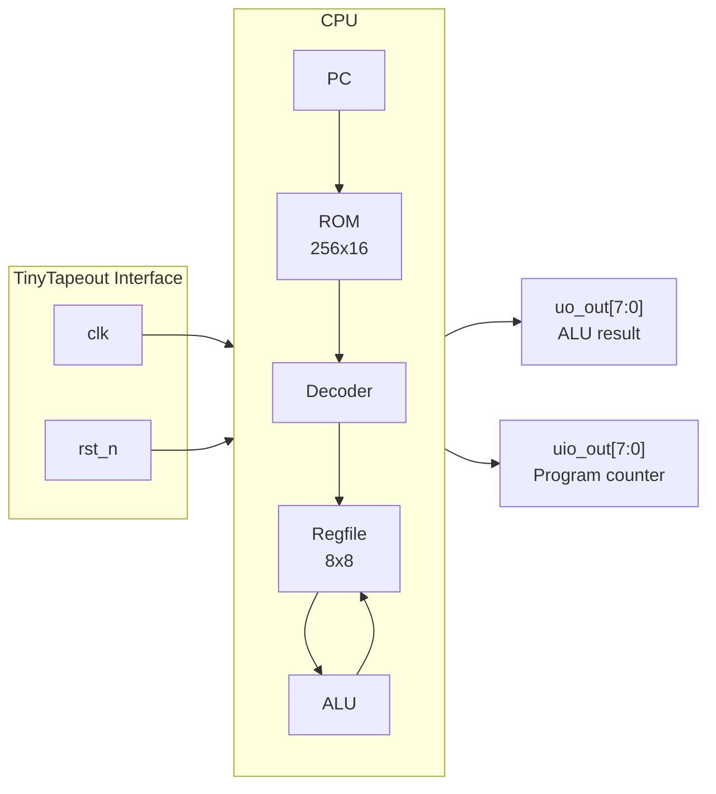

   

# 8-bit Single-Cycle CPU

> **A behavioral-free RISC processor on TinyTapeout**



## Documentation

| Module | Description | Docs |
|--------|-------------|------|
| **TOP** | TinyTapeout wrapper | [top.md](docs/top.md) |
| **CPU** | 8-bit single-cycle processor | [cpu.md](docs/cpu.md) |

## Instruction Set

16 opcodes with 16-bit encoding, 8 registers, Kogge-Stone adder:

```
ADD  SUB  AND  OR   XOR  NOT  NAND NOR
XNOR ADDI LDI  JMP  BEQ  LOAD STORE NOP
```

See [cpu.md](docs/cpu.md) for full ISA reference.

## Pin Usage

- **`uo_out[7:0]`** : ALU result
- **`uio_out[7:0]`** : Program counter
- **`clk`** : System clock
- **`rst_n`** : Active-low reset

## Project Structure

```
src/
├── top.v           # TinyTapeout wrapper
├── cpu.v           # CPU top module
├── rom.v           # 256x16 instruction memory
├── decoder.v       # Instruction decoder + control
├── regfile.v       # 8x8 register file (2R/1W)
├── alu.v           # 9-operation ALU
├── kogge-stone.v   # Parallel prefix adder
├── pc.v            # Program counter
├── mux.v           # Parameterized mux/demux
├── register.v      # N-bit register
└── dff.v           # D flip-flop

tools/
├── assembler.py    # Assembly → hex
├── trace.py        # FST waveform trace viewer
└── example.asm     # Example program

test/
├── test_cpu.py     # CPU integration tests (cocotb)
├── test_alu.py     # ALU unit tests
├── ...             # 54 tests total
```

## Tooling

```bash
# Assemble a program
python tools/assembler.py tools/example.asm -o test/program.hex -v

# Run tests
source .venv/bin/activate
make -f Makefile.cpu

# View execution trace
python tools/trace.py test/tb_cpu.fst --last
```
