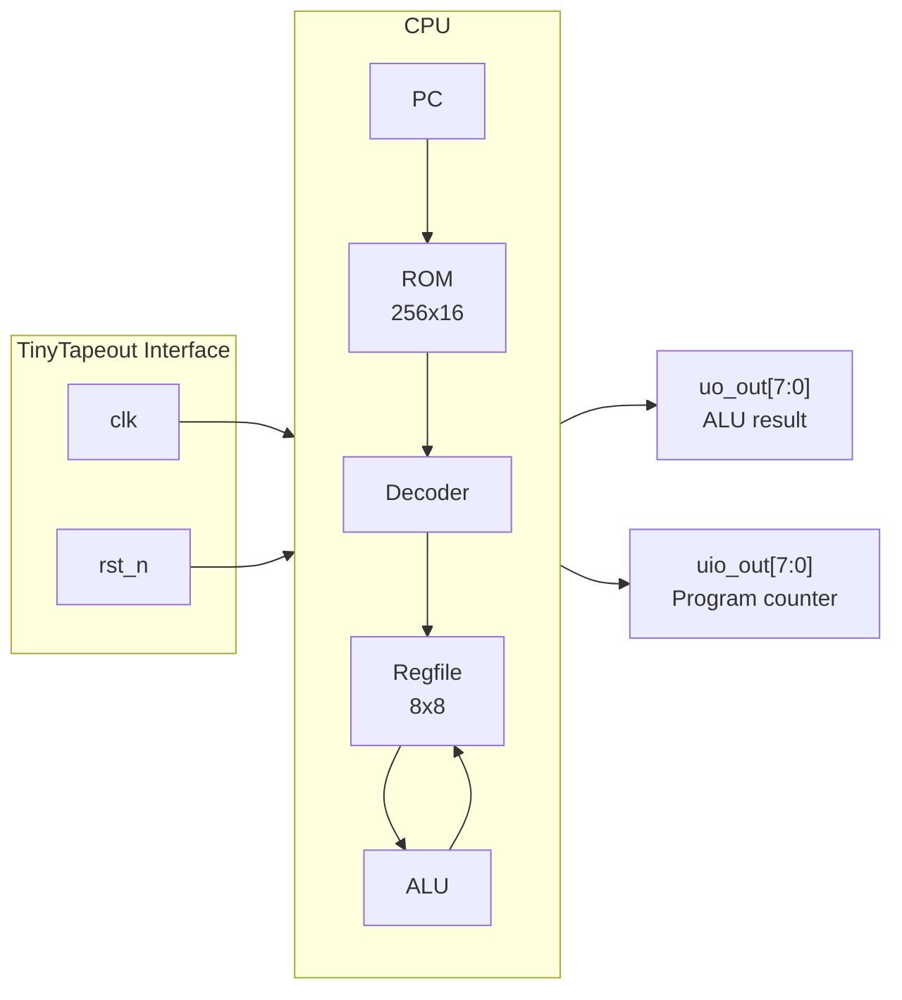
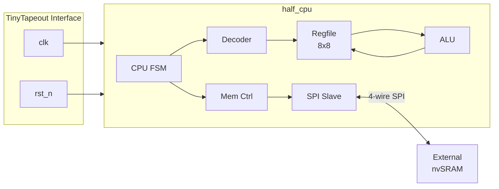

   

# 8-bit CPU on TinyTapeout

> **A behavioral-free RISC processor built entirely from dataflow and structural Verilog**

Two variants: a **single-cycle** CPU with internal ROM, and a **multi-cycle** CPU (`half_cpu`) with external memory over SPI.

### Single-cycle CPU



### Multi-cycle CPU (half_cpu)



## Instruction Set

16 opcodes, 16-bit encoding, 8 registers, Kogge-Stone adder:

```
ADD  SUB  AND  OR   XOR  NOT  NAND NOR
XNOR ADDI LDI  JMP  BEQ  LOAD STORE NOP
```

See [cpu.md](modules/integration/cpu/cpu.md) for full ISA reference.

## Modules

Each module is a self-contained package with source, docs, tests, and a `manager.json` declaring dependencies. The manager resolves transitive deps automatically.

### Integration

| Module | Description | Docs |
|--------|-------------|------|
| top | TinyTapeout wrapper | [top.md](modules/integration/top/top.md) |
| cpu | Single-cycle processor (ROM-based) | [cpu.md](modules/integration/cpu/cpu.md) |
| half_cpu | Multi-cycle CPU — memory access via SPI | [half_cpu.md](modules/integration/half_cpu/half_cpu.md) |

### Subsystem

| Module | Description | Docs |
|--------|-------------|------|
| cpu_fsm | Fetch/decode/execute/writeback FSM | [cpu_fsm.md](modules/subsystem/cpu_fsm/cpu_fsm.md) |
| mem_ctrl | Abstract memory requests → SPI transactions (nvSRAM) | [mem_ctrl.md](modules/subsystem/mem_ctrl/mem_ctrl.md) |
| spi_slave | SPI slave with TX/RX shift registers and CDC | [spi_slave.md](modules/subsystem/spi_slave/spi_slave.md) |

### Lib — Core

| Module | Description | Docs |
|--------|-------------|------|
| alu | 9-operation 8-bit ALU (Kogge-Stone) | [alu.md](modules/lib/core/alu/alu.md) |
| alu_operand_mux | Selects ALU operand B (rs2 or immediate) | [alu_operand_mux.md](modules/lib/core/alu_operand_mux/alu_operand_mux.md) |
| writeback_mux | 3-way mux for register writeback source | [writeback_mux.md](modules/lib/core/writeback_mux/writeback_mux.md) |
| decoder | Instruction field extraction + control signals | [decoder.md](modules/lib/core/decoder/decoder.md) |
| regfile | 8x8-bit register file, 2R/1W | [regfile.md](modules/lib/core/regfile/regfile.md) |
| register | Parameterized N-bit register (from DFFs) | [register.md](modules/lib/core/register/register.md) |
| pipeline_reg | Latches on condition, holds otherwise | [pipeline_reg.md](modules/lib/core/pipeline_reg/pipeline_reg.md) |
| kogge-stone | O(log N) parallel prefix adder | [kogge-stone.md](modules/lib/core/kogge-stone/kogge-stone.md) |
| pc | 8-bit program counter with jump load | [pc.md](modules/lib/core/pc/pc.md) |
| rom | Parameterized ROM from hex file | [rom.md](modules/lib/core/rom/rom.md) |

### Lib — Cells

| Module | Description | Docs |
|--------|-------------|------|
| dff | Master-slave D flip-flop from NAND gates | [dff.md](modules/lib/cells/dff/dff.md) |
| mux | Recursive tree-structured mux/demux | [mux.md](modules/lib/cells/mux/mux.md) |
| zero_flag | Parameterized zero detector | [zero_flag.md](modules/lib/cells/zero_flag/zero_flag.md) |

### Lib — SPI

| Module | Description | Docs |
|--------|-------------|------|
| cdc_sync | N-stage FF synchronizer + edge detector | [cdc_sync.md](modules/lib/spi/cdc_sync/cdc_sync.md) |
| spi_byte_counter | Tracks 8 SCLK edges per byte, byte_done pulse | [spi_byte_counter.md](modules/lib/spi/spi_byte_counter/spi_byte_counter.md) |
| spi_shift_tx | 8-bit MSB-first TX shift register (MISO) | [spi_shift_tx.md](modules/lib/spi/spi_shift_tx/spi_shift_tx.md) |
| spi_shift_rx | 8-bit MSB-first RX shift register (MOSI) | [spi_shift_rx.md](modules/lib/spi/spi_shift_rx/spi_shift_rx.md) |

### Lib — Memory

| Module | Description | Docs |
|--------|-------------|------|
| read_data_accum | Assembles 16-bit word from SPI RX bytes | [read_data_accum.md](modules/lib/mem/read_data_accum/read_data_accum.md) |

## Pin Usage

- **`uo_out[7:0]`** : ALU result
- **`uio_out[7:0]`** : Program counter
- **`clk`** : System clock
- **`rst_n`** : Active-low reset

## Project Structure

```
modules/                        # 24 Verilog modules (monorepo packages)
  lib/cells/                    #   primitives: dff, mux, zero_flag
  lib/core/                     #   datapath: alu, decoder, regfile, pc, ...
  lib/spi/                      #   SPI: cdc_sync, shift registers, byte counter
  lib/mem/                      #   memory: read_data_accum
  subsystem/                    #   controllers: cpu_fsm, mem_ctrl, spi_slave
  integration/                  #   top-level: cpu, half_cpu, top
  <module>/
    <module>.v                  #   source
    <module>.md                 #   documentation
    manager.json                #   {"name": "...", "deps": [...]}
    test/                       #   tb_*.v + test_*.py (cocotb)

src/                            # TinyTapeout symlinks → modules/
artifacts/                 # shared build artifacts (gitignored)
tools/
  manager/                      # unified manager (dep resolution + test runner)
  Makefile.sim                  # generic shared Makefile
  assembler/                    # assembly → hex ROM files
  trace/                        # per-cycle CPU execution trace
  waveform/                     # signal viewer (transitions, tables, waves)
manage.py                       # entry point → tools/manager/manager.py
```

## Tooling

```bash
# Interactive manager (packages + tools)
python manage.py

# Run tests for a module (resolves transitive deps automatically)
python manage.py --run alu
python manage.py --run half_cpu --fst

# Show dependency tree
python manage.py --deps half_cpu

# Run a tool directly
python manage.py --tool assembler -- tools/assembler/example.asm -v

# View execution trace
python manage.py --tool trace -- artifacts/cpu/tb_cpu.fst --last
```
