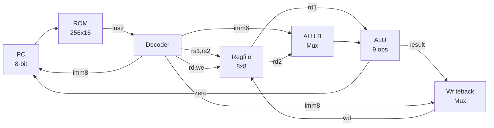

[Back to Main](../README.md)

# CPU - 8-bit Single-Cycle Processor

> **Behavioral-free RISC processor built entirely from dataflow and structural Verilog**

## Overview

A single-cycle CPU executing 16-bit instructions from a 256-entry ROM. Each clock cycle fetches, decodes, executes, and writes back one instruction. No `always` blocks — only `assign` and module instantiation (except ROM which uses `$readmemh`).

## Architecture



## Instruction Set

16-bit instructions with 4-bit opcode:

| Opcode | Mnemonic | Format | Operation |
|--------|----------|--------|-----------|
| `0000` | ADD | R | `rd = rs1 + rs2` |
| `0001` | SUB | R | `rd = rs1 - rs2` |
| `0010` | AND | R | `rd = rs1 & rs2` |
| `0011` | OR | R | `rd = rs1 \| rs2` |
| `0100` | XOR | R | `rd = rs1 ^ rs2` |
| `0101` | NOT | U | `rd = ~rs1` |
| `0110` | NAND | R | `rd = ~(rs1 & rs2)` |
| `0111` | NOR | R | `rd = ~(rs1 \| rs2)` |
| `1000` | XNOR | R | `rd = ~(rs1 ^ rs2)` |
| `1001` | ADDI | I | `rd = rs1 + imm6` |
| `1010` | LDI | L | `rd = imm8` |
| `1011` | JMP | L | `PC = imm8` |
| `1100` | BEQ | L | `if (zero) PC = imm8` |
| `1101` | LOAD | I | reserved |
| `1110` | STORE | I | reserved |
| `1111` | NOP | - | no operation |

## Instruction Encoding

```
R-type:  [opcode:4][rd:3][rs1:3][rs2:3][---:3]
U-type:  [opcode:4][rd:3][rs1:3][------:6]
I-type:  [opcode:4][rd:3][rs1:3][imm6:6]
L-type:  [opcode:4][rd:3][imm8:8][0:1]
```

## Registers

8 general-purpose 8-bit registers (`r0`-`r7`), all reset to 0.

## Components

| Module | File | Description |
|--------|------|-------------|
| `cpu` | `src/cpu.v` | Top-level: wiring fetch/decode/execute/writeback |
| `rom` | `src/rom.v` | 256x16 instruction memory (`$readmemh`) |
| `decoder` | `src/decoder.v` | Instruction field extraction + control signals |
| `regfile` | `src/regfile.v` | 8x8 register file, 2 read / 1 write port |
| `alu` | `src/alu.v` | 9-operation ALU with Kogge-Stone adder |
| `kogge_stone` | `src/kogge-stone.v` | Parameterized parallel prefix adder |
| `pc` | `src/pc.v` | Program counter with load/increment |
| `mux` | `src/mux.v` | Parameterized multiplexer/demultiplexer |
| `register` | `src/register.v` | Parameterized N-bit register |
| `dff` | `src/dff.v` | D flip-flop with async reset |

## Tooling

| Tool | Usage |
|------|-------|
| `tools/assembler.py` | `python assembler.py program.asm -o program.hex` |
| `tools/trace.py` | `python trace.py test/tb_cpu.fst --last` |
| `tools/example.asm` | Example assembly program |

## Testing

54 tests across all modules using cocotb + Icarus Verilog:

```bash
source .venv/bin/activate
make -f Makefile.cpu    # 8 CPU integration tests
make -f Makefile.alu    # 5 ALU tests
make -f Makefile.decoder # 11 decoder tests
# etc.
```

---
[Back to Main](../README.md)
