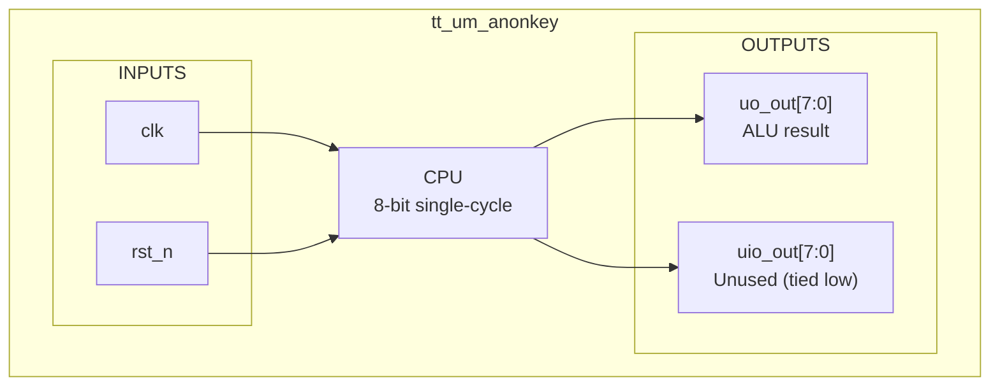

[Back to Main](../README.md)

# TOP Module - CPU Wrapper

> **TinyTapeout wrapper exposing the 8-bit CPU through dedicated I/O pins**

## Overview

The `tt_um_anonkey` module wraps the single-cycle CPU and maps its outputs to TinyTapeout pins.

## Block Diagram

## Pin Description

### Inputs
- **`clk`** : System clock
- **`rst_n`** : Active-low reset
- **`ena`** : Enable (unused, always 1)
- **`ui_in[7:0]`** : Unused
- **`uio_in[7:0]`** : Unused

### Outputs
- **`uo_out[7:0]`** : ALU result (current instruction's computation)
- **`uio_out[7:0]`** : Unused (tied to `8'h00`)
- **`uio_oe[7:0]`** : All set to input (`8'h00`)

## File Location
- **Source**: `modules/integration/top/top.v`
- **Dependencies**: `cpu.v`

---
[Back to Main](../README.md)
